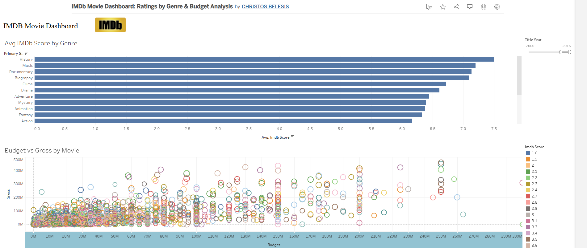

# 🎬 IMDb Movie Dashboard

An interactive Tableau Public dashboard analyzing IMDb movies by **genre**, **budget**, and **gross revenue** from 2000 to 2016.

 

## 📊 Dashboard Overview

The dashboard provides:

- ✅ Average IMDb rating per genre
- ✅ Budget vs Gross scatter plot with tooltips
- ✅ Interactive filters (Genre selector, Year range slider)
- ✅ Clean design with IMDb branding

 

## 🔗 Live Dashboard

👉 [View on Tableau Public](https://public.tableau.com/app/profile/christos.belesis/viz/IMDbMovieDashboardRatingsbyGenreBudgetAnalysis/Dashboard1?publish=yes)

 

## 🖼️ Preview

> *The dashboard was created using Tableau Public and IMDb movie data (CSV).*

 

## 🛠️ Tools Used

- Tableau Public
- Custom calculated fields
- Data cleaning and visualization techniques

 

## 📁 Dataset

The dataset includes information on:
- Movie titles, release years
- Budget and gross revenue
- IMDb scores
- Genres

 

## ✍️ Author

**Christos Belesis**  
GitHub: [@cbelesis](https://github.com/cbelesis)  
Tableau Public: [Christos Belesis](https://public.tableau.com/app/profile/christos.belesis)
